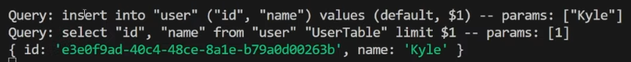

src:
- https://www.youtube.com/watch?v=i_mAHOhpBSA (Fireship 2024)
- https://www.youtube.com/watch?v=7-NZ0MlPpJA (Web Dev Simplified 2024)

# Intro (Fireship)

Drizzle ORM is a lightweight set of tools that makes type-safe object relational mapping (ORM) with your favorite  
relational database fun again.  

Most apps in the real world rely on databases like MySQL, PostgreSQL, and SQLite to store their critical user data.  
But working with raw SQL can be painful, and even life-threatening when you screw up.  

Over the decades, hundreds of libraries have been built to abstract away SQL code to hide its complexity inside your favorite  
object-oriented programming language. This technique is called "Object Relational mapping".  

ORM is great and all, but can often bring unnecessary performance overhead, and cause leaky abstractions because  
the developers have no idea how their underlying SQL code actually works.  

Drizzle is an ORM that takes the opposite approach.  
It provides an API in TypeScript that closely matches the native underlying SQL code.

```ts
await db
  .select()
  .from(countries)
  .leftJoin(cities, eq(cities.countryId = countries.id))
  .where(eq(countries.id, 10))
```

```php
SELECT * FROM countries LEFT JOIN cities ON cities.countryId = countries.id WHERE countries.id = 10;
```

This gives you the benefits of both **Type Safety** and **Intellisense** without all the crazy abstractions.  

# But how is that possible when every database is different?

Instead of trying to jam everything into a single API, Drizzle provides dedicated adapters for each one of them.  
Along with dedicated tools for popular Cloud hosts like RDS and Neon.  

But if the above TypeScript code looks too raw and uncensored for you, Drizzle also provides an optional **Prisma-like query API**   
that keeps your data fetching and join code concise and readable.  

In addition, it provides an optional **CLI** for handling database migrations called **Drizzle Kit**.  

But the cherry on top is **Drizzle Studio**, a GUI you can run locally to manage your data.  

# Get started

To get started, you'll first need a relational database.  
Drizzle is designed to run on any JS runtime like Node.js, Bun and Deno, as well as Edge runtimes like Cloudflare workers.  

## installation and connection to the database

- install Drizzle: `npm i drizzle-orm`
- install your database driver: `npm i <db_driver>`
- install Drizzle Kit for migrations: `npm i -D drizzle-kit`
  
Alternatively, you can use the Drizzle Setup CLI for one-command setup: `npx drizzle-setup`  
This tool guides you through selecting your database and installs all required packages automatically.

- then connect to the database in your TypeScript code (index.ts)
- before starting to make queries, you need to create a `schema.ts` file
  - in this schema file, define your **tables** using the `pgTable` function
  - each table has a name followed by columns defined in a JavaScript object, like in the example below
    ```ts
    export const users = pgTable('users', {
      id: serial('id', primaryKey(),
      name: text('name'),
      email: text('email').unique(),
      createdAt: timestamp('created_at').notNull().defaultNow()
    });
    ```
  - columns are given constraints with JS functions that match their SQL equivalent, such as `notNull()`
  - once a table is defined, we can reference it in other tables to create relationships with foreign keys
  - optionally, we can use the `relations()` function to simplify relational queries and joints

---
End of Fireship's video, start of Web Dev Simplified video
---

# Intro (WDS video)

There are 3 different components to Drizzle:
- Drizzle ORM
- Drizzle Kit
- Drizzle Studio

Drizzle allows you to work with 3 types of DB:
- PostgreSQL
- MySQL
- SQLite

# Drizzle Setup

- first, you need to choose your database type: MySQL, PostgreSQL, or SQLite
- then pick the database driver of your choice (check Drizzle documentation)
- install Drizzle and the DB driver of your choice (postgre in our case): `npm i drizzle-orm pg`
- also install Drizzle Kit for handling things like DB migrations: `npm i -D drizzle-kit tsx @types/pg`
  - `-D` is shorthand for `--save-dev`, it installs the specified package and adds it to the devDependencies
  
We can also install another package via `npm i dotenv` to help us work with environment variables
- create a `.env` file at the root of your project to store your **environment variables** such as `DATABASE_URL`
- then create a `drizzle.config.ts` file, also at the root of your project

## drizzle.config.ts

```ts
import { defineConfig } from "drizzle-kit";

export default defineConfig({
  schema: "./src/drizzle/schema.ts",
  out: "./src/drizzle/migrations",
  dialect: "postgresql",
  dbCredentials: {
    url: process.env.DATABASE_URL as string
  },
  verbose: true,
  strict: true
});
```
- We need to specify the location of our schema.ts file.  
- The `out` option specifies the folder where our migration files are going to be put.
  - whenever I do a DB migration, the migration files will be generated inside the provided location
- the `driver` option specifies which DB driver we are using (postgres.js in our example)
- the `dbCredentials` is for allowing the connection to our database
- enabling the `verbose` option is to know exactly what changes will be made when we run a migration
- enabling the `strict` option is to be prompted for confirming the changes we're about to make to our DB

## schema.ts

```ts
import { pgTable, uuid, serial, varchar } from "drizzle-orm/pg-core";

export const UserTable = pgTable("user", {
  id: uuid("id").primaryKey().defaultRandom(),
  name: varchar("name", { length: 100 }).notNull()
})
```
- the first line would import from "mysql-core" if we were to use a MySQL database.
- We need to export classes for each one of our tables (one class = one table).
- The `pgTable` function requires to be passed a table name, and the different columns of our table
  - for the first column, we give it a key of "id" and we use the uuid function to name it "id"
  - in most cases, the key and the name will be the exact same value
  - for the id property, we could have also written `id: serial("id").primaryKey()` to get an autoincremental value
 
The above code snippet is a simple schema for a single table.  
Let's see how to do a migration for that.

## Migration file creation

Now that we have our config file and our schema set up, we can do our migration just by running `npx drizzle-kit generate:<driver>`  
If using the postgres.js driver, the command will be `npx drizzle-kit generate:pg`   

This command will generate a migration file (.sql format) for us that has everything we need.  
For example:
```sql
CREATE TABLE IF NOT EXISTS "user" (
    "id" uuid PRIMARY KEY DEFAULT gen_random_uuid() NOT NULL,
    "name" varchar(255) NOT NULL
);
``` 

If we want to remove this migration for some reason: 
- run `npx drizzle-kit drop`
- select the migration file you want to delete

It's recommended to add a migration script to your package.json file:
```json
"scripts": {
  "dev": "tsx watch src/main.ts",
  "db:generate": "drizzle-kit generate:pg"
},
```
After adding this script, you can run `npm run db:generate` to generate your migration files.  

**Side note**:   
The `tsx watch` command is used to run a TypeScript file (or files) and automatically restart the process whenever any of the source files or their dependencies change. 
This enables a "hot reload" workflow similar to what tools like nodemon provide for JavaScript, but optimized for TypeScript projects.  

## Applying our migration file to our database (migrate.ts)

We need to create a file that lets us apply the migrations.  
In your /src/drizzle folder, create a `migrate.ts` file.  

```ts
import "dotenv/config"
import { drizzle } from 'drizzle-orm/postgres-js';
import { migrate } from 'drizzle-orm/postgres-js/migrator';
import postgres from 'postgres';

// create a new migration client
const migrationClient = postgres(process.env.DATABASE_URL as string, { max: 1 });

async function main() {
  await migrate(drizzle(migrationClient), {
  migrationsFolder: "./src/drizzle/migrations"
  })

  await migrationClient.end()  // close the migration client
}

main()
```
- the first line will load our environment variables located in the `.env` file
- the last line calls the async function that will run the migration

No matter which DB driver you use, the migrate.ts file will look almost exactly the same, except for the imports.  

## DATABASE_URL and running the migration

You can host your database wherever you want, you just need to specify its URL in your `.env` file.  
Once that's done, you can finally run your `migrate.ts` file to apply the migration to your database.  

For that, let's add another useful script to our `package.json` file:
```json
"scripts": {
  "dev": "tsx watch src/main.ts",
  "db:generate": "drizzle-kit generate:pg",
  "db:migrate": "tsx src/drizzle/migrate.ts"
},
```
This way, we can run `npm run db:migrate` to apply the migration to our database.

# Drizzle Studio

In order to test all of that, we can use **Drizzle Studio**, which allows us to view our database inside our browser.  
- run `npx drizzle-kit studio`
- you might need to install an additional package: `npm i pg`
- open up your browser and go to https://local.drizzle.studio

# Connecting to our database

- create a `db.ts` file inside your /src/drizzle folder
```ts
import { drizzle } from "drizzle-orm/postgres-js"
import * as schema from "./schema"
import postgres from "postgres"

const client = postgres(process.env.DATABASE_URL as string)
export const db = drizzle(client, { schema, logger: true })
```
It was important to export all our future tables in our schema.ts file so that we can import them now.  

Now that we have configure our db.ts file, we can access our database from anywhere in our project.  

# main.ts

Inside our /src folder, we should have a `main.ts` file.  
Check this file to see how we can interact with our database  

Once our main.ts file is ready, we can run `npm run dev` to execute it.  
In our example, this will use an async function to:
- add a new user to our database
- then retrieve it from the DB
- log our first user details to the console

We will also see the SQL queries thanks to the `logger: true` option in our `db.ts` file.  

In the following screenshot, you can see the 2 queries and the user information:  


# Schema Advanced


---
@19/56
